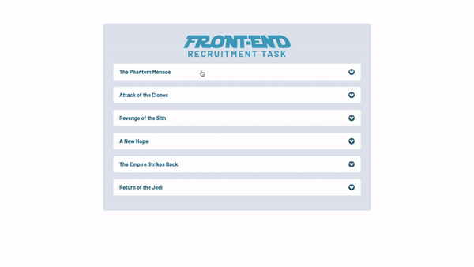

# Star Wars App

The app displays information about planets that appear in 6 movies of the Star Wars series.

Live version is available [here](https://star-wars-app-murex.vercel.app/).

<br/>



<br/>

## Table of contents

1. Technologies
2. Setup
3. Short description

<br/>

## 1. Technologiess

The following technologies were used in the project:

- React
- Styled Components

<br/>

## 2. Setup

First of all, you need to make sure you have [Node.js](https://nodejs.org/en/) installed.

If you have Node.js installed clone the github repo.

Open the project in your favourite IDE and run following script for downloading dependencies:

```
npm install
# or
yarn install
```

After that, run the development server:

```
npm start
# or
yarn start
```

Open [http://localhost:3000](http://localhost:3000) with your browser to see the result.

<br/>

## 3. Short description

The app contains titles related to individual parts of the Star Wars movie.

When you click on a specific movie title, a list of planets (with properties) appears in the table that are related to that part of the movie.

By clicking on a specific table category heading, you can sort the table records according to the category you clicked.

For devices with a screen width of less than 750px, the application UI has been changed to increase the readability of the data.
